# 🎭 prompt-mask

<a href="https://buymeacoffee.com/promptmask" target="_blank"></a>

**Anonymize your prompts before sending them to AI. 100% local. Zero data leaves your device.**

prompt-mask sits between you and the AI — you mask sensitive data before sending, and unmask the response when it comes back. Names, emails, amounts, secrets: the AI never sees the real thing.

No server. No account. No tracking. Just open the page and go.



## How it works

```
You type:    "Draft an email to ***{Jean Dupont} at ***{Nexus Tech} about +++{450k€}"
prompt-mask: "Draft an email to Alex Morgan at Vertex Labs about 518k€"
AI responds: "Dear Alex Morgan from Vertex Labs..."
prompt-mask: "Dear Jean Dupont from Nexus Tech..."
```

## Quick Start

### Web App (recommended — no install)

**Use it now:** [cloudspawn.github.io/prompt-mask](https://cloudspawn.github.io/prompt-mask)

Or download `app/index.html` and open it locally. Works offline, works everywhere.

### How to use

1. **SEAL mode** — Write your prompt, mark sensitive data, hit SEAL, copy the masked output to your AI tool
2. **UNSEAL mode** — Paste the AI response, hit UNSEAL, get the real data back

Three ways to mark sensitive data:

| Method | How |
|--------|-----|
| **Type markers** | `***{Jean Dupont}` directly in the text |
| **Right-click** | Select text → right-click → choose action |
| **Keyboard** | Select text → Ctrl+1, Ctrl+2, or Ctrl+3 |
| **Propagate** | After marking, propagate to all identical occurrences |
| **Right-click marked text** | Remove marker or change type |

### Mini-Language

| Marker | Action | Reversible? | Example |
|--------|--------|-------------|---------|
| `***{text}` | **Anonymize** — realistic fake replacement | ✅ Yes | `***{Jean Dupont}` → `Alex Morgan` |
| `+++{text}` | **Randomize** — same type, different value | ✅ Yes | `+++{450k€}` → `518k€` |
| `---{text}` | **Block** — permanently redact | ❌ No | `---{password}` → `[REDACTED:1]` |

Use `***` and `+++` when you need the AI to work with realistic data and want to restore it later. Use `---` for secrets that should never be stored anywhere.

## Features

- **Seal / Unseal** — mask before sending, unmask after receiving
- **Auto-dictionary** — consistent mappings that build up over time
- **Projects** — separate dictionaries per client/project/context
- **Prompt history** — automatic log of everything you've sealed, searchable, exportable
- **Mini audit** — stats on what you've protected
- **Export / Import** — backup and share your dictionaries and history
- **Context menu & shortcuts** — right-click or Ctrl+1/2/3 for fast marking

## 🔒 Privacy by Design

This is NOT a web app that sends your data somewhere. It's a single HTML file that runs entirely in your browser.

- ❌ No server — nothing is hosted, processed, or stored remotely
- ❌ No database — your data lives in your browser's localStorage only
- ❌ No account — no signup, no login, no email
- ❌ No tracking — no analytics, no cookies, no telemetry
- ❌ No network requests — ever, under any circumstance
- ✅ Works fully offline — download the file, disconnect your WiFi
- ✅ Open source — read every line of code yourself

### How to verify

1. Open DevTools (F12)
2. Go to the Network tab
3. Use the app
4. See for yourself: zero network requests

## CLI

A Python CLI for developers. Zero dependencies, pure Python 3.8+.

### Install

```bash
pip install prompt-mask
# or from source
git clone https://github.com/cloudspawn/prompt-mask.git && cd prompt-mask
pip install -e .
```

### Example session

```
$ prompt-mask scan "Jean Dupont (CEO, Nexus Tech) called Marie Laurent.
  Jean Dupont wants to close the 450k deal by 15/03/2025.
  Contact: jdupont@nexus-tech.com
  Jean Dupont and Marie Laurent will sign next week."

Scanning...

  Emails:
    jdupont@nexus-tech.com  (1x)  ->  [a]nonymize [b]lock [r]andomize [s]kip ? a

  Dates:
    15/03/2025  (1x)  ->  [a]nonymize [b]lock [r]andomize [s]kip ? r

  Amounts:
    450k  (1x)  ->  [a]nonymize [b]lock [r]andomize [s]kip ? r

  Names:
    Jean Dupont    (3x)  ->  [a]nonymize [b]lock [r]andomize [s]kip ? a
    Marie Laurent  (2x)  ->  [a]nonymize [b]lock [r]andomize [s]kip ? a
    Nexus Tech     (1x)  ->  [a]nonymize [b]lock [r]andomize [s]kip ? a

Apply 7 changes? [y/N] y
Alex Morgan (CEO, Vertex Labs) called Sam Rivera.
Alex Morgan wants to close the 382k deal by 28/02/2025.
Contact: contact@vertex-labs.com
Alex Morgan and Sam Rivera will sign next week.

Sealed: 10 new + 0 from dictionary.
```

Next time, the dictionary already knows these names -- use `auto`:

```
$ prompt-mask auto "Reminder: Jean Dupont from Nexus Tech meets Marie Laurent on Friday."

Known entries found:
  Jean Dupont   -> Alex Morgan   (1x, name)
  Marie Laurent -> Sam Rivera    (1x, name)
  Nexus Tech    -> Vertex Labs   (1x, company)

Apply all replacements? [y/N] y
Reminder: Alex Morgan from Vertex Labs meets Sam Rivera on Friday.
Auto-sealed: 3 replacements from dictionary.
```

### Commands

**Seal** -- process markers in text:
```bash
prompt-mask seal "Send invoice to ***{Jean Dupont} at ***{Nexus Tech}"
prompt-mask seal spec.md -o spec-safe.md
cat file.md | prompt-mask seal > safe.md
```

**Unseal** -- restore real data:
```bash
prompt-mask unseal "Send invoice to Alex Morgan at Vertex Labs"
prompt-mask unseal response.md -o final.md
```

**Auto** -- seal using existing dictionary (no markers needed):
```bash
prompt-mask auto spec.md -o spec-safe.md
prompt-mask auto spec.md -o spec-safe.md -y  # skip confirmation
```

**Scan** -- interactive detection of sensitive data:
```bash
prompt-mask scan spec.md -o spec-safe.md
```
Detects names, emails, IPs, phone numbers, dates, amounts, URLs, and API keys/tokens.
For each finding, choose: `[a]nonymize [b]lock [r]andomize [s]kip`.

**Projects:**
```bash
prompt-mask project list
prompt-mask project create client-x
prompt-mask project use client-x
prompt-mask project delete client-x
```

**Dictionary:**
```bash
prompt-mask dict list
prompt-mask dict add --real "Secret Corp" --fake "Public Inc"
prompt-mask dict remove --real "Secret Corp"
prompt-mask dict export -o backup.json
prompt-mask dict import -i backup.json
prompt-mask dict clear
```

Dictionary format is identical to the web app -- export from one, import in the other.

## Roadmap

- [x] Web app — core seal/unseal with mini-language
- [x] Right-click context menu & keyboard shortcuts
- [x] Consistent auto-dictionary (localStorage)
- [x] Project/context system
- [x] Dictionary manager (view, add, delete, export, import)
- [x] Seal/unseal mode with clear UX guidance
- [x] Prompt history (auto-save, search, reuse, export)
- [x] Numbered redaction (non-reversible, nothing stored)
- [x] Mini audit & stats
- [x] GitHub Pages deployment
- [x] CLI — seal, unseal, auto, scan, project & dict management
- [x] Test suite (41 tests)
- [ ] Browser extension (next)

## Development

```bash
git clone https://github.com/cloudspawn/prompt-mask.git
cd prompt-mask
uv sync

# Serve the web app locally
cd app && python3 -m http.server 8080
```

## Support

prompt-mask is free, open source, and always will be. If it saves you time or protects your data, consider buying me a coffee:

<a href="https://buymeacoffee.com/promptmask" target="_blank"></a>

## Contributing

Contributions welcome! Please open an issue first to discuss what you'd like to change.

## License

[MIT](LICENSE)
